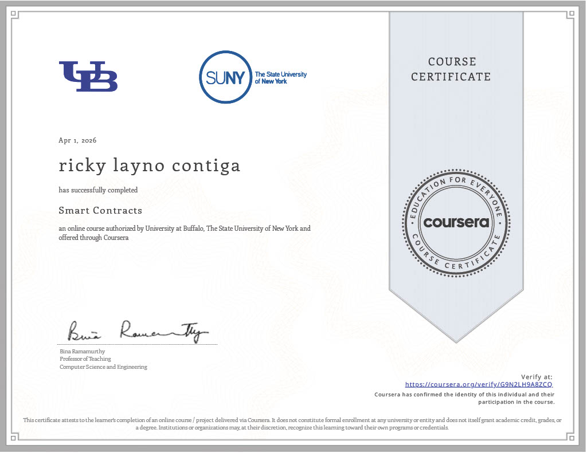
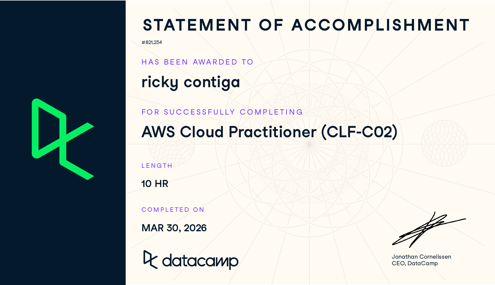
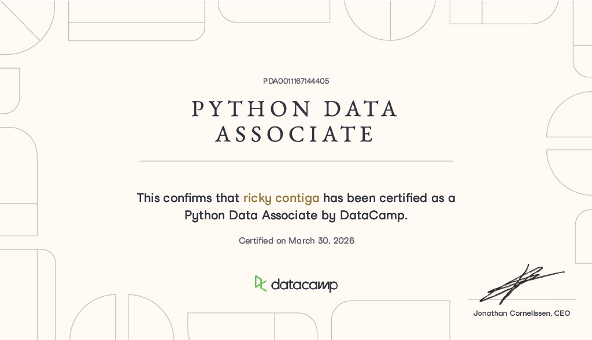
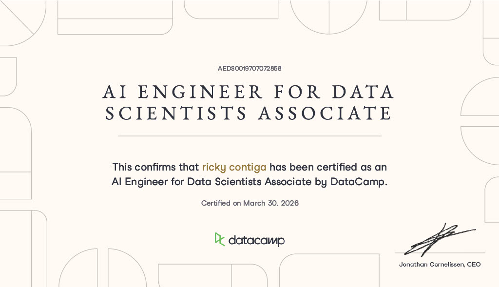
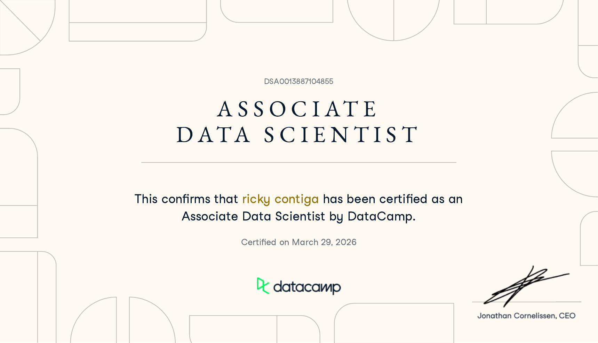
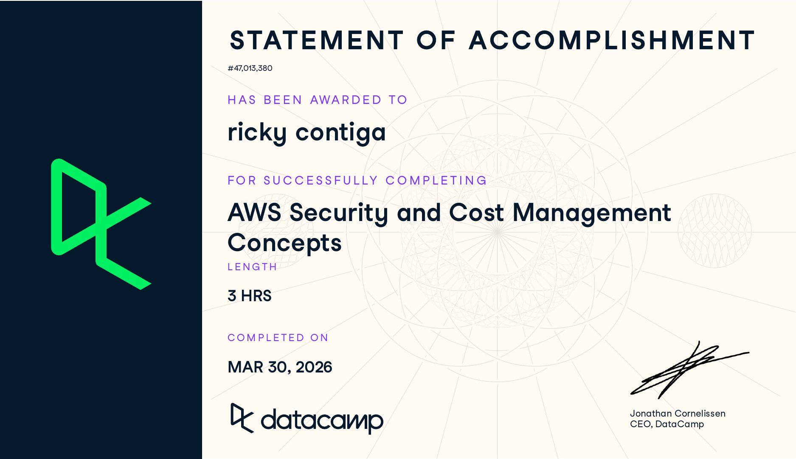

<h1 align="center">Ricky Layno Contiga</h1>

<strong>RICKYLER</strong> | Frontend, Mobile, and Web3 Developer

  I build modern, responsive, and user-focused products across web, mobile, and blockchain.
  I am also growing my expertise in cloud, data, and AI to deliver stronger end-to-end solutions.

  
  
  

## Professional Summary

- Build clean and responsive digital experiences with `React`, `Next.js`, `TypeScript`, and modern frontend tooling.
- Develop cross-platform mobile applications with `Flutter` and `Dart`.
- Explore blockchain product development with `Solidity`, smart contracts, and Web3 integrations.
- Continue strengthening cloud, data, and AI capabilities through practical learning and certification.

## Core Stack

| Area | Technologies |
| --- | --- |
| Frontend | `React`, `Next.js`, `TypeScript`, `JavaScript`, `HTML`, `CSS`, `Tailwind CSS` |
| Mobile | `Flutter`, `Dart`, `Android Studio` |
| Web3 | `Solidity`, `Smart Contracts`, `Polygon` |
| Backend and Data | `Node.js`, `Python`, `Firebase`, `MongoDB`, `MySQL`, `PostgreSQL` |
| Tools | `Git`, `Docker`, `Linux`, `VS Code`, `IntelliJ` |

## Certifications

<table>
  <tr>
    <td width="50%">
      
    </td>
    <td width="50%">
      
    </td>
  </tr>
  <tr>
    <td width="50%">
      
    </td>
    <td width="50%">
      
    </td>
  </tr>
  <tr>
    <td width="50%">
      
    </td>
    <td width="50%">
      
    </td>
  </tr>
</table>

## Credential Details

| Certification | Provider | Completed | Credential Reference |
| --- | --- | --- | --- |
| Smart Contracts | University at Buffalo, The State University of New York via Coursera | Apr 1, 2026 | [Verify on Coursera](https://coursera.org/verify/G9N2LH9ARZCQ) |
| AWS Cloud Practitioner (CLF-C02) | DataCamp | Mar 30, 2026 | Statement `#821,234` |
| Python Data Associate | DataCamp | Mar 30, 2026 | `PDA001167144405` |
| AI Engineer for Data Scientists Associate | DataCamp | Mar 30, 2026 | `AEDS0019707072858` |
| Associate Data Scientist | DataCamp | Mar 29, 2026 | `DSA0013887104855` |
| AWS Security and Cost Management Concepts | DataCamp | Mar 30, 2026 | Statement `#47,013,380` |

## Current Focus

- Frontend engineering and polished user interfaces
- Mobile application development
- Web3 products and smart contract integrations
- Cloud fundamentals, data workflows, and AI-enabled solutions

## GitHub Analytics

  
  

